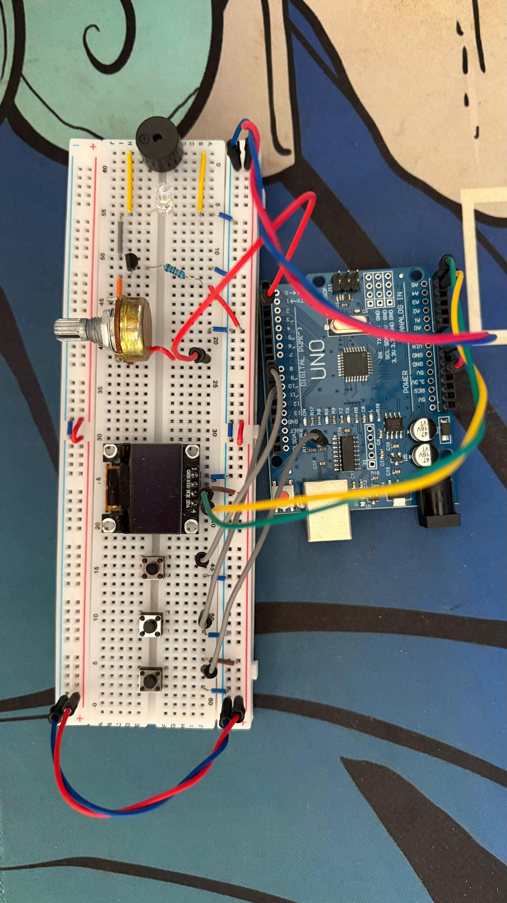

<div align="center">

# 🎵 Music Player v1.0

**Player de músicas interativo com display OLED, menu de seleção e reprodução não-bloqueante**

[](https://www.arduino.cc/)
[](https://isocpp.org/)
[](https://choosealicense.com/licenses/mit/)

</div>

---

## 📋 Descrição

O **Music Player v1.0** é a evolução natural do projeto Jukebox: em vez de botões físicos por música, este projeto implementa um **menu navegável** em um display OLED SSD1306 de 128×64 pixels. O usuário navega pelo catálogo com os botões Próxima/Anterior e pressiona Play para iniciar ou parar a reprodução.

O diferencial técnico central é o **motor de áudio não-bloqueante** — a música toca em paralelo com a atualização do display, permitindo animações em tempo real como título rolante, barra de progresso e visualizador de reprodução, sem pausar o sketch entre notas.

---

## ⚙️ Componentes Utilizados

| Quantidade | Componente | Especificação |
|:---:|---|---|
| 1x | Arduino Uno (ou compatível) | Microcontrolador ATmega328P |
| 1x | Display OLED SSD1306 | 128×64 px, interface I2C |
| 1x | Buzzer piezoelétrico passivo | Conectado ao pino D2 |
| 3x | Push buttons | Play (D9), Próxima (D13), Anterior (D11) |
| 1x | Transistor NPN | Amplificação de corrente do buzzer |
| 1x | Resistor | 10kΩ (base do transistor) |
| 1x | LED branco | Indicador de status |
| 1x | Potenciômetro | Ajuste de volume/brilho |
| — | Jumper wires | Macho-macho |
| 1x | Protoboard | — |

---

## 🔌 Pinagem

```
Arduino Uno
├── D2  → Buzzer passivo (via transistor NPN)
├── D9  → Botão Play/Stop             [INPUT_PULLUP]
├── D11 → Botão Anterior              [INPUT_PULLUP]
├── D13 → Botão Próxima               [INPUT_PULLUP]
├── A4 (SDA) → SDA do display OLED
└── A5 (SCL) → SCL do display OLED

Display OLED SSD1306
├── VCC → 3.3V ou 5V
├── GND → GND
├── SDA → A4
└── SCL → A5
```

> **Pull-up interno:** os três botões utilizam `INPUT_PULLUP`, ou seja, leem `HIGH` em repouso e `LOW` quando pressionados — sem resistor externo necessário.

---

## 🖼️ Esquemático




---

## 🎶 Músicas Disponíveis

| Índice | Música | BPM |
|:---:|---|:---:|
| 0 | 🎤 Take on Me – A-HA | 140 |
| 1 | 🎹 Für Elise – Beethoven | — |
| 2 | 💃 Despacito – Luis Fonsi | — |

---

## 💻 Como Funciona

### Arquitetura do Software

O projeto divide responsabilidades em três arquivos principais:

```
sketch_player_music.ino   → Loop principal, leitura de botões, controle de tela
func_musica.cpp           → Motor de áudio, dados das músicas, função de desenho
func_musica.h             → Declarações externas e protótipos de funções
assets.h                  → Assets gráficos (ícones, bitmaps para o display)
pitches.h                 → Macros de frequências (NOTE_C4, NOTE_D5, etc.)
```

### Motor de Áudio Não-Bloqueante

O coração do projeto é o mecanismo de reprodução que **não usa `delay()`**. Em vez disso, o loop principal verifica se chegou a hora de tocar a próxima nota usando `millis()`:

```cpp
void atualizarMusica() {
  if (!estaTocando) return;
  
  if (millis() >= tempoProximaNota) {
    // toca a nota atual
    tone(pinBuzzer, nota, duracao * 0.9);
    notaAtual++;
    tempoProximaNota = millis() + duracao;  // agenda a próxima
  }
}
```

Isso libera o processador a cada ciclo do loop para outras tarefas — como atualizar o display — sem bloquear a execução.

### Sistema de Menu com Scroll

O menu exibe três itens por vez: o anterior, o atual (destacado com fundo invertido) e o próximo. Quando o título da música selecionada é maior que os 128 pixels da tela, ele rola horizontalmente com velocidade configurável:

```cpp
const int VELOCIDADE_SCROLL = 300;  // ms entre cada deslocamento de 1 caractere
const int LARGURA_CARACTERE = 6;    // pixels por caractere na fonte padrão
```

A posição de scroll (`indiceScroll`) avança a cada `VELOCIDADE_SCROLL` ms e reinicia ao fim do texto.

### Controle de Play/Stop

O botão Play funciona como toggle. Se uma música estiver tocando, pressionar Play a para; se nenhuma estiver tocando, inicia a música selecionada:

```cpp
void iniciarMusica(int numero) {
  if (estaTocando) {
    estaTocando = false;
    noTone(pinBuzzer);   // para o som imediatamente
  } else {
    musicaSendoTocada = numero;
    estaTocando = true;
    notaAtual = 0;
    tempoProximaNota = millis();
  }
}
```

### Tela de Reprodução

Durante a reprodução, o display exibe:
- Título da música em scroll horizontal
- Barra de progresso proporcional à nota atual vs. total de notas
- Visualizador animado (via `assets.h`)

O display é atualizado a cada **50ms (~20 FPS)** para suavidade visual sem sobrecarregar o I2C.

### Codificação das Notas (PROGMEM)

Assim como no Jukebox, as melodias são armazenadas na Flash com `PROGMEM` como pares `(frequência_Hz, divisor_de_duração)`. O divisor negativo indica nota pontuada (duração × 1.5).

---

## 🗂️ Estrutura dos Arquivos

```
Player de música/
├── readme.md                          # Esta documentação
├── sketch_playermusic/
│   ├── sketch_player_music.ino        # Loop, botões, controle de navegação e tela
│   ├── func_musica.cpp                # Motor de áudio + dados das músicas
│   ├── func_musica.h                  # Header: extern vars e protótipos
│   ├── assets.h                       # Bitmaps e assets gráficos para o OLED
│   └── pitches.h                      # Macros de frequência de notas
└── circuit_image/
    ├── image_simulator.png            # Simulação no Wokwi/Tinkercad
    └── real_circuit_image.jpg         # Foto do circuito físico montado
```

---

## 📦 Bibliotecas Necessárias

Instale via **Arduino IDE → Tools → Manage Libraries**:

| Biblioteca | Autor | Uso |
|---|---|---|
| `Adafruit SSD1306` | Adafruit | Driver do display OLED |
| `Adafruit GFX Library` | Adafruit | Primitivas gráficas (linhas, retângulos, texto) |
| `Wire` | Arduino (built-in) | Comunicação I2C |

Ou use as versões locais incluídas em `/libraries` na raiz do repositório.

---

## 🚀 Como Usar

1. **Instale as bibliotecas** listadas acima.
2. **Monte o circuito** conforme o esquemático.
3. **Abra o sketch:** `sketch_playermusic/sketch_player_music.ino`.
   > ⚠️ O Arduino IDE precisa que `func_musica.cpp`, `func_musica.h`, `assets.h` e `pitches.h` estejam **na mesma pasta** do `.ino`.
4. **Selecione a placa e porta:** `Tools → Board → Arduino Uno` e `Tools → Port`.
5. **Faça upload:** `Ctrl+U`.
6. Ao iniciar, o display exibe a tela de boas-vindas por 3 segundos e abre o menu.
7. **Navegue** com os botões Próxima/Anterior e pressione **Play** para iniciar.

---

## 🔧 Adicionando Músicas

1. Em `func_musica.cpp`, adicione o array da melodia com `PROGMEM`:
   ```cpp
   const int melody_NovaSong[] PROGMEM = { NOTE_C5, 4, NOTE_E5, 4, ... };
   const int notes_NovaSong = sizeof(melody_NovaSong) / sizeof(melody_NovaSong[0]) / 2;
   ```
2. Adicione o nome ao array `musicas[]` e incremente `totalDeMusicas`.
3. Declare `notes_NovaSong` como `extern` em `func_musica.h`.
4. Adicione o `case` correspondente no `switch` de `atualizarTela()` em `sketch_player_music.ino`.

---

*Desenvolvido por Felipe Grolla*

